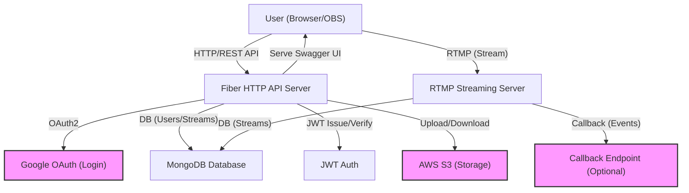
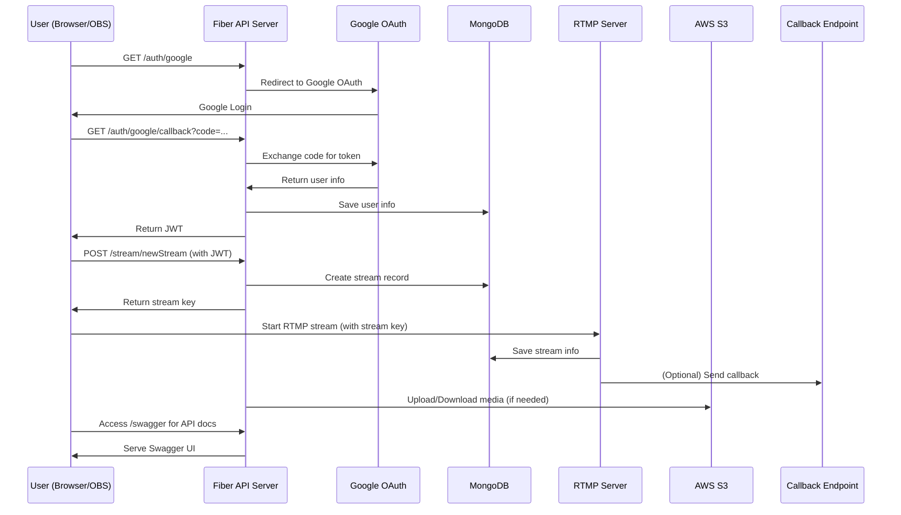

# Streamit

Streamit is a scalable live streaming platform built with Go, Fiber, and RTMP. It supports user authentication via Google OAuth, secure JWT-based APIs, real-time video streaming, and integration with AWS S3 for storage.

## Features
- **User Authentication**: Google OAuth 2.0 login
- **JWT Secured APIs**: All endpoints are protected with JWT
- **Live Streaming**: RTMP server for ingesting live streams
- **REST API**: Manage users, channels, and streams
- **Swagger UI**: Interactive API documentation at `/swagger`
- **MongoDB**: Stores user, channel, and stream data
- **AWS S3**: For media storage (optional)
- **Callback Support**: Optional callback endpoint for stream events

## Architecture
The following diagram illustrates the high-level architecture of Streamit:



## Workflow
The following sequence diagram shows the main user and system interactions:



## Getting Started

### Prerequisites
- Go 1.18+
- MongoDB instance
- AWS account (for S3, optional)
- Google OAuth credentials

### Setup
1. **Clone the repository:**
   ```bash
   git clone <repo-url>
   cd Streamit
   ```
2. **Set environment variables:**
   - Copy `.env.example` to `.env` and fill in your credentials (MongoDB URI, Google OAuth, JWT secret, S3, etc.)
3. **Install dependencies:**
   ```bash
   go mod tidy
   ```
4. **Run the server:**
   ```bash
   go run main.go
   ```
5. **Access API docs:**
   - Open [http://localhost:8080/swagger](http://localhost:8080/swagger) in your browser.

## API Documentation
- The OpenAPI/Swagger spec is available at `/swagger.json`.
- Interactive Swagger UI is served at `/swagger`.

## Project Structure
- `main.go` - Entry point, server setup
- `controllers/` - API endpoint logic
- `router/` - Route definitions
- `middleware/` - Auth and other middleware
- `models/` - Data models
- `utils/` - Utility functions (DB, JWT, S3, etc.)
- `rtmp_*.go` - RTMP server and streaming logic
- `swagger.json` - OpenAPI spec

## Contributing
1. Fork the repo
2. Create your feature branch (`git checkout -b feature/YourFeature`)
3. Commit your changes (`git commit -am 'Add some feature'`)
4. Push to the branch (`git push origin feature/YourFeature`)
5. Open a pull request

## License
MIT

---

For questions or support, please open an issue or contact the maintainer. 